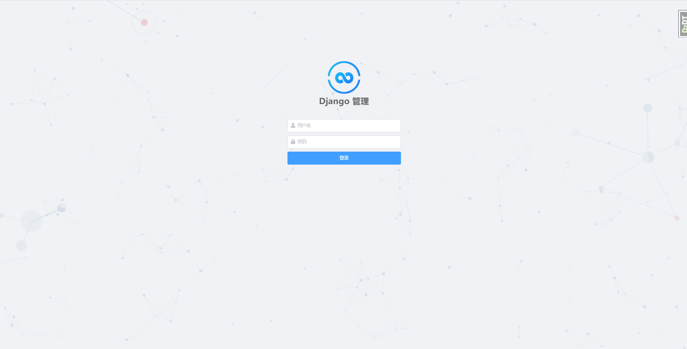
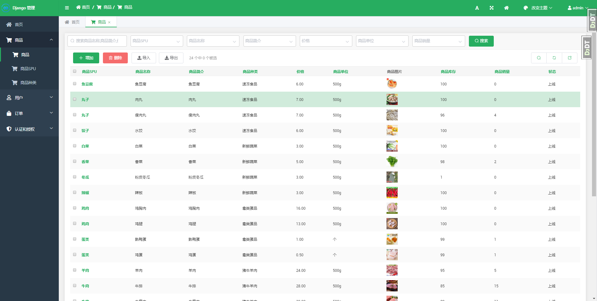
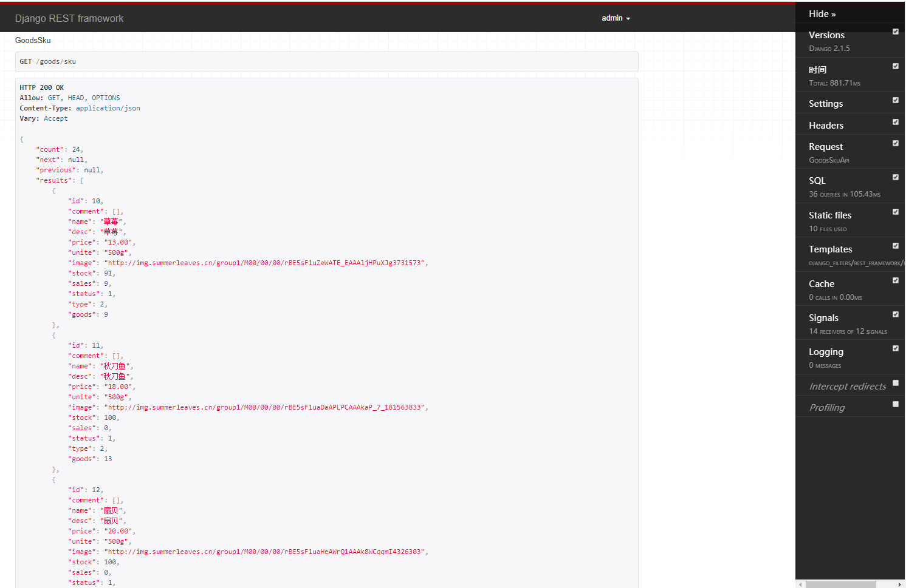
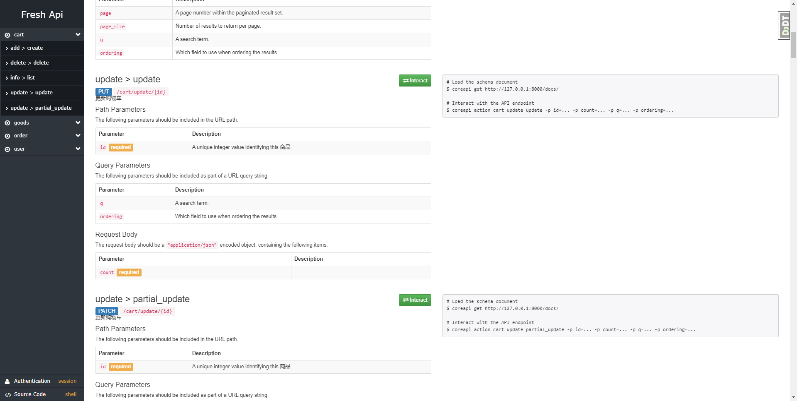
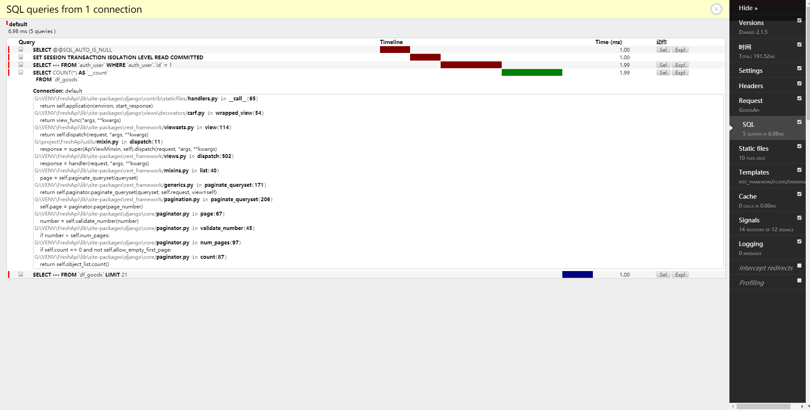

# FreshApi    B2C-分布式生鲜商城

**FreshApi是一个基于生鲜商城开发的restful api**

#### 项目地址  : [http://freshapi.summerleaves.cn/](http://freshapi.summerleaves.cn/)
#### 文档地址  ：[http://freshapi.summerleaves.cn/docs](http://freshapi.summerleaves.cn/docs)

####  技术栈
* 语言：Python3.6.8  (Django==2.1.5， djangorestframework)
* 数据库: MySql、 redis
* 任务队列(异步处理): celery
* 分布式文件存储: FastDFS
* 搜索引擎(商品检索)： django-haystack 、whoosh、drf-haystack、django-filter
* web服务器配置: Nginx+ uwsgi
* 数据导出与导入: django-import_export
* 后台管理: django-admin + django-simpleui

#### 项目实例

*   后台页面
	
	

*   开发者测试接口页面
    

*   Api文档页面
    

*   DEBUG页面
    
    

### 配置详情
*  [点击查看参考MVC版](https://github.com/Ivy-1996/fresh)

